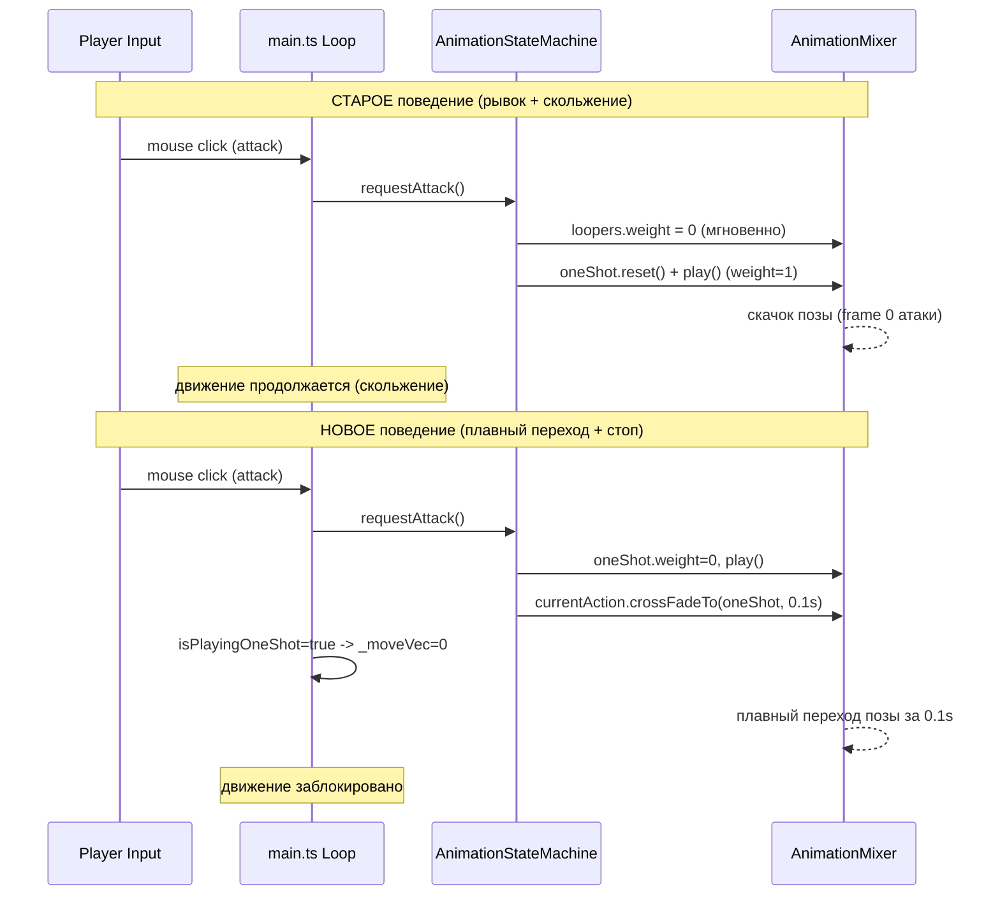

# План: Плавные анимации атаки и остановка движения

## Проблемы

### 1. Рывок при атаке
При нажатии удара из idle или walk анимация переключается мгновенно — персонаж "дергается" в стартовую позу атаки.

**Причина**: Метод `playOneShot` в [`AnimationStateMachine`](client/src/animationStateMachine.ts:108):
- Сразу обнуляет `weight=0` и ставит `paused=true` на все looping-анимации (idle, walk, run)
- Одновременно стартует one-shot атаку с `weight=1`, `time=0` (первый кадр)
- Нет cross-fade — переключение веса происходит мгновенно, без интерполяции

### 2. Скольжение при атаке в движении
При атаке во время бега/ходьбы персонаж продолжает двигаться по инерции.

**Причина**: В [`main.ts`](client/src/main.ts:284-346) движение обрабатывается каждый кадр независимо от состояния анимации. Флаг `isPlayingOneShot` в FSM не проверяется при расчете движения.

---

## Решения

### Решение 1: Cross-fade для one-shot анимаций (убирает рывок)

Вместо мгновенного обнуления loopers, используем `crossFadeTo` как в методе `transitionTo`:

```
Текущая логика:
  loopers.weight = 0 (мгновенно)
  oneShot.play() с weight=1 (мгновенно)
  --> РЕЗКИЙ ПЕРЕХОД

Новая логика:
  oneShot.weight = 0 (начало)
  oneShot.play()
  currentAction.crossFadeTo(oneShot, 0.1s)
  --> через 0.1с oneShot.weight = 1, loopers остановлены
  --> ПЛАВНЫЙ ПЕРЕХОД
```

### Решение 2: Блокировка движения во время атаки (убирает скольжение)

Перед обработкой движения проверяем флаг `isPlayingOneShot`:

```
В main.ts, до расчета _moveVec:
  if (fsm['local']?.isPlayingOneShot) {
      _moveVec.set(0, 0, 0);
      // пропускаем физику, коллизии, отправку move на сервер
  }
```

Это также автоматически блокирует движение при `requestHitReaction`, что логично.

---

## Изменяемые файлы

### 1. [`client/src/animationStateMachine.ts`](client/src/animationStateMachine.ts)

**Метод `playOneShot`** (строка 108):
- Убрать мгновенное `weight=0, paused=true` на loopers
- Добавить `action.weight = 0` перед `action.play()`
- Добавить cross-fade с текущей looping-анимацией через `crossFadeTo`
- Константа `ONE_SHOT_FADE_DURATION = 0.1` (100ms)
- В `onFinished` callback: явно восстановить loopers (weight=1, paused=false, play)

**Псевдокод:**
```typescript
const ONE_SHOT_FADE_DURATION = 0.1;

public playOneShot(actionName: string, timeScale: number = 1.0): void {
    const action = this.actions[actionName];
    if (!action) return;

    this.isPlayingOneShot = true;
    this.stateBeforeOneShot = this.currentStateName || 'idle';

    const currentAction = this.currentStateName ? this.actions[this.currentStateName] : null;

    // Prepare one-shot
    action.reset();
    action.setLoop(THREE.LoopOnce, 1);
    action.clampWhenFinished = true;
    action.timeScale = timeScale;
    action.weight = 0;  // start invisible, cross-fade brings it in
    action.play();

    // Cross-fade from current looping action to one-shot
    if (currentAction && currentAction.isRunning() && currentAction !== action) {
        currentAction.crossFadeTo(action, ONE_SHOT_FADE_DURATION, false);
    } else {
        action.weight = 1;  // no blend needed
    }

    this.currentStateName = actionName;

    const onFinished = () => {
        this.mixer.removeEventListener('finished', onFinished);
        action.stop();
        action.timeScale = 1.0;

        if (this.isDying || this.isDead) {
            this.isPlayingOneShot = false;
            return;
        }

        // Restore loopers (crossFadeTo may have stopped them)
        Object.values(this.actions).forEach(a => {
            if (a && a.loop === THREE.LoopRepeat) {
                a.weight = 1;
                a.paused = false;
                if (!a.isRunning()) a.play();
            }
        });
        this.isPlayingOneShot = false;
        this._returnToIdle();
    };
    this.mixer.addEventListener('finished', onFinished);
}
```

### 2. [`client/src/main.ts`](client/src/main.ts)

**В теле loop()** (после проверки `alive`, перед расчетом `_moveVec`, строка 227):

```typescript
if (alive) {
    // Блокировка движения во время атаки / hitReaction
    const isAttacking = fsm['local']?.isPlayingOneShot || false;
    if (isAttacking) {
        _moveVec.set(0, 0, 0);
    }

    if (actionMode) {
        _moveVec.copy(getCameraRelativeMovement(camera));
    }
    // ... остальная логика
```

Также нужно импортировать `fsm` (уже импортирован из `player.ts` на строке 5).

---

## Mermaid: сравнение старого и нового поведения


