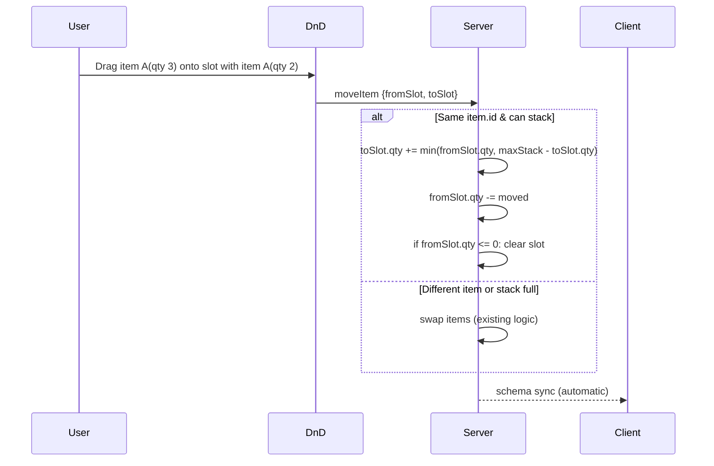
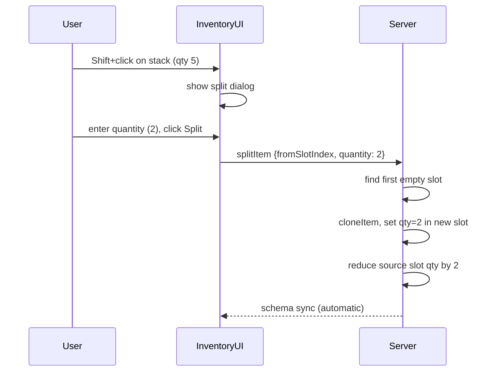

# Plan: Auto-Stacking + Split Stack

## 1. Auto-Stacking on Drag & Drop

### Description
When dragging an item onto a slot that already contains the same item type (same `item.id`), instead of swapping, merge the stacks up to `maxStack`.

### Server Changes

#### `server/src/MyRoom.ts` — modify `moveItem` handler

Add stacking logic before the swap fallback:

```typescript
// If same item type, try to stack
if (toSlot.item && fromSlot.item && toSlot.item.id === fromSlot.item.id) {
    const maxStack = toSlot.item.maxStack;
    const canAdd = maxStack - toSlot.quantity;
    if (canAdd > 0) {
        const toMove = Math.min(fromSlot.quantity, canAdd);
        toSlot.quantity += toMove;
        fromSlot.quantity -= toMove;
        if (fromSlot.quantity <= 0) {
            fromSlot.item = null;
            fromSlot.quantity = 0;
        }
        PlayerPersistence.savePlayer(player);
        return;  // stacked, no swap needed
    }
}
// Otherwise: swap items (existing code)
```

#### `server/src/MyRoom.ts` — modify `unequipToSlot` handler

Currently fails if destination slot is not empty. Change to allow stacking if same item type:

```typescript
const destSlot = player.inventory.slots[toSlotIndex];
if (!destSlot) return;
// If destination has same item, stack instead
if (destSlot.item && destSlot.item.id === item.id) {
    const maxStack = destSlot.item.maxStack;
    const canAdd = maxStack - destSlot.quantity;
    if (canAdd > 0) {
        EquipmentSystem.applyBonuses(player.stats, item.bonuses, -1);
        player.equipment.delete(slot);
        destSlot.quantity = Math.min(destSlot.quantity + 1, maxStack);
        EquipmentSystem.recalculateStats(player);
        PlayerPersistence.savePlayer(player);
        return;
    }
}
// Must be empty if different item
if (destSlot.item) return;
// ... rest of existing unequipToSlot logic
```

## 2. Split Stack

### Description
Player can Shift+click on a stack with quantity > 1, choose how many items to split off, and those items go to the nearest empty slot.

### Client Changes

#### `client/src/inventoryUI.ts` — add Shift+click handler

Add a Shift+click event listener to each slot:

```typescript
slot.addEventListener('click', (event) => {
    if (!event.shiftKey) return;
    const index = parseInt(slot.dataset.index!);
    const slotData = getSlotData(index);
    if (!slotData || !slotData.item || slotData.quantity <= 1) return;
    // Show split quantity dialog
    showSplitDialog(index, slotData.item.name, slotData.quantity);
});
```

#### `client/src/inventoryUI.ts` — add split dialog

Simple inline dialog using existing DOM patterns:

```typescript
let splitDialog: HTMLDivElement | null = null;

function showSplitDialog(slotIndex: number, itemName: string, maxQuantity: number) {
    // Create overlay
    const overlay = document.createElement('div');
    overlay.style.position = 'fixed';
    overlay.style.top = '0';
    overlay.style.left = '0';
    overlay.style.width = '100%';
    overlay.style.height = '100%';
    overlay.style.background = 'rgba(0,0,0,0.3)';
    overlay.style.zIndex = '9998';
    overlay.addEventListener('click', () => closeSplitDialog());

    // Create dialog
    const dialog = document.createElement('div');
    dialog.style.position = 'fixed';
    dialog.style.top = '50%';
    dialog.style.left = '50%';
    dialog.style.transform = 'translate(-50%, -50%)';
    dialog.style.background = '#222';
    dialog.style.border = '2px solid #888';
    dialog.style.borderRadius = '8px';
    dialog.style.padding = '16px';
    dialog.style.zIndex = '9999';
    dialog.style.color = 'white';
    dialog.style.fontFamily = 'Arial, sans-serif';
    dialog.style.minWidth = '200px';
    dialog.style.textAlign = 'center';

    const title = document.createElement('div');
    title.textContent = 'Split: ' + itemName;
    title.style.marginBottom = '12px';
    title.style.fontWeight = 'bold';
    dialog.appendChild(title);

    const input = document.createElement('input');
    input.type = 'number';
    input.min = '1';
    input.max = String(maxQuantity - 1);
    input.value = String(Math.floor(maxQuantity / 2));
    input.style.width = '80px';
    input.style.padding = '6px';
    input.style.fontSize = '16px';
    input.style.textAlign = 'center';
    input.style.background = '#333';
    input.style.color = 'white';
    input.style.border = '1px solid #555';
    input.style.borderRadius = '4px';
    dialog.appendChild(input);

    const label = document.createElement('div');
    label.textContent = '/ ' + maxQuantity;
    label.style.marginTop = '6px';
    label.style.color = '#aaa';
    label.style.fontSize = '12px';
    dialog.appendChild(label);

    const btnContainer = document.createElement('div');
    btnContainer.style.marginTop = '12px';
    btnContainer.style.display = 'flex';
    btnContainer.style.gap = '8px';
    btnContainer.style.justifyContent = 'center';

    const confirmBtn = document.createElement('button');
    confirmBtn.textContent = 'Split';
    confirmBtn.style.padding = '6px 16px';
    confirmBtn.style.background = '#44aa44';
    confirmBtn.style.color = 'white';
    confirmBtn.style.border = 'none';
    confirmBtn.style.borderRadius = '4px';
    confirmBtn.style.cursor = 'pointer';
    confirmBtn.addEventListener('click', () => {
        const qty = parseInt(input.value);
        if (qty > 0 && qty < maxQuantity) {
            room?.send('splitItem', { fromSlotIndex: slotIndex, quantity: qty });
        }
        closeSplitDialog();
    });
    btnContainer.appendChild(confirmBtn);

    const cancelBtn = document.createElement('button');
    cancelBtn.textContent = 'Cancel';
    cancelBtn.style.padding = '6px 16px';
    cancelBtn.style.background = '#555';
    cancelBtn.style.color = 'white';
    cancelBtn.style.border = 'none';
    cancelBtn.style.borderRadius = '4px';
    cancelBtn.style.cursor = 'pointer';
    cancelBtn.addEventListener('click', closeSplitDialog);
    btnContainer.appendChild(cancelBtn);

    dialog.appendChild(btnContainer);
    document.body.appendChild(overlay);
    document.body.appendChild(dialog);
    splitDialog = dialog;

    // Auto-focus and select
    setTimeout(() => {
        input.focus();
        input.select();
    }, 50);
}

function closeSplitDialog() {
    if (splitDialog) {
        const overlay = splitDialog.previousSibling;
        if (overlay) document.body.removeChild(overlay);
        document.body.removeChild(splitDialog);
        splitDialog = null;
    }
}
```

### Server Changes

#### `server/src/MyRoom.ts` — add `splitItem` handler

```typescript
this.onMessage("splitItem", (client, message: { fromSlotIndex: number, quantity: number }) => {
    const player = this.state.players.get(client.sessionId);
    if (!player || player.hp <= 0) return;
    const { fromSlotIndex, quantity } = message;
    if (fromSlotIndex < 0 || fromSlotIndex >= player.inventory.slots.length) return;
    const fromSlot = player.inventory.slots[fromSlotIndex];
    if (!fromSlot || !fromSlot.item) return;
    if (fromSlot.quantity <= quantity || quantity <= 0) return; // must leave at least 1
    // Find first empty slot
    for (let i = 0; i < player.inventory.slots.length; i++) {
        if (i === fromSlotIndex) continue;
        const slot = player.inventory.slots[i];
        if (!slot.item) {
            slot.item = fromSlot.item.cloneItem();
            slot.quantity = quantity;
            fromSlot.quantity -= quantity;
            PlayerPersistence.savePlayer(player);
            return;
        }
    }
    // No empty slot — could send error message back to client
});
```

## Summary of Files to Modify

| File | Change |
|------|--------|
| `server/src/MyRoom.ts` | Modify `moveItem` — add stacking before swap |
| `server/src/MyRoom.ts` | Modify `unequipToSlot` — allow stacking on same item |
| `server/src/MyRoom.ts` | Add new `splitItem` handler |
| `client/src/inventoryUI.ts` | Add Shift+click handler + split quantity dialog |

## Data Flow Diagrams

### Auto-Stack Flow



### Split Stack Flow


