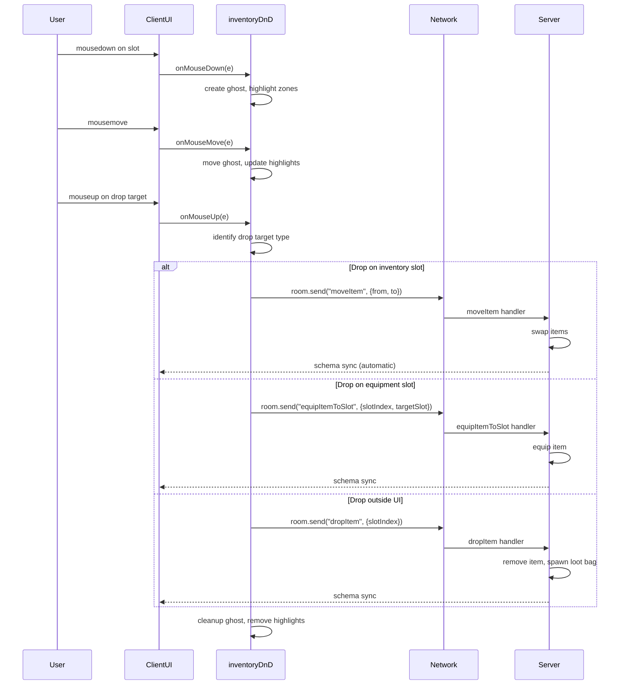

# Plan: Drag & Drop Inventory System

## Overview

Add full Drag & Drop support to the inventory system, allowing players to:
- Rearrange items within the inventory grid
- Drag items from inventory to equipment slots
- Drag items from equipment slots back to inventory
- Drop items outside any window to discard them on the ground

The system uses custom mouse events (mousedown/mousemove/mouseup) for full control over visual feedback, rather than the HTML5 Drag and Drop API.

---

## Architecture

### New Server Messages

1. **`"moveItem"`** -- Rearrange items within inventory
   - Payload: `{ fromSlotIndex: number, toSlotIndex: number }`
   - Logic: Swap items between source and destination slots. If either is empty, move the item. Server validates both indices.

2. **`"dropItem"`** -- Drop item on the ground
   - Payload: `{ slotIndex: number }`
   - Logic: Remove item from inventory, spawn a loot bag at the player's position with the dropped item.

3. **`"equipItemToSlot"`** -- Equip item by dragging to a specific equipment slot
   - Payload: `{ slotIndex: number, targetSlot: string }`
   - Logic: Same as existing `equipItem` but specifies the target equipment slot directly (e.g., "head", "weapon").

4. **`"unequipToSlot"`** -- Unequip item to a specific inventory slot
   - Payload: `{ slot: string, toSlotIndex: number }`
   - Logic: Remove item from equipment, insert it into the specified inventory slot.

### Client-side Modules

#### `client/src/inventoryDnD.ts` (NEW FILE)

Central module managing the drag & drop lifecycle.

**State:**
- `dragState: { isDragging, sourceType, sourceIndex, sourceElement, itemData, ghostElement }`

**Functions:**
- `initDragDrop()` -- Attach mousedown listeners to all draggable elements (inventory slots, equipment slots)
- `destroyDragDrop()` -- Cleanup listeners
- `_onMouseDown(event)` -- Start drag if left-click on a non-empty slot
- `_onMouseMove(event)` -- Move ghost element, highlight valid drop targets
- `_onMouseUp(event)` -- Complete the drop or cancel

**Drop Zones (identified by data attributes):**
- `[data-dropzone="inventory"][data-slot-index="N"]` -- Inventory grid slots
- `[data-dropzone="equipment"][data-equip-slot="head/chest/..."]` -- Equipment slots
- `body` -- Outside any window = drop on ground

**Visual Feedback:**
- Ghost element: semi-transparent clone of the dragged item, follows cursor
- Valid targets get a green highlight border
- Invalid targets get a red highlight
- On drop: flash animation at target slot

#### `client/src/inventoryUI.ts` (MODIFIED)

- Add `data-dropzone="inventory"` and `data-slot-index="i"` attributes to slot elements
- Add `data-draggable="true"` attribute for drag source detection
- Export `slotElements` array for drag system access

#### `client/src/characterPanel.ts` (MODIFIED)

- Add `data-dropzone="equipment"` and `data-equip-slot="head/chest/..."` attributes to equipment slot divs
- Add `data-draggable="true"` for dragging from equipment slots
- Export equipment slot references for drag system

#### `client/src/network.ts` (MODIFIED)

No changes needed -- inventory/equipment state is synced automatically via Colyseus Schema.

#### `server/src/MyRoom.ts` (MODIFIED)

Add four new message handlers:
- `"moveItem"` handler
- `"dropItem"` handler
- `"equipItemToSlot"` handler (reuses EquipmentSystem)
- `"unequipToSlot"` handler (reuses EquipmentSystem)

---

## Implementation Steps

### Step 1: Server -- Add new message handlers

**File: `server/src/MyRoom.ts`**

Add these handlers inside `onCreate()` after existing `unequipItem` handler:

**1a. `"moveItem"` handler:**
```typescript
this.onMessage("moveItem", (client, message: { fromSlotIndex: number, toSlotIndex: number }) => {
    const player = this.state.players.get(client.sessionId);
    if (!player || player.hp <= 0) return;
    const { fromSlotIndex, toSlotIndex } = message;
    if (fromSlotIndex === toSlotIndex) return;
    if (fromSlotIndex < 0 || fromSlotIndex >= player.inventory.slots.length) return;
    if (toSlotIndex < 0 || toSlotIndex >= player.inventory.slots.length) return;
    const fromSlot = player.inventory.slots[fromSlotIndex];
    const toSlot = player.inventory.slots[toSlotIndex];
    if (!fromSlot.item) return;
    // Swap items
    const tempItem = toSlot.item;
    const tempQty = toSlot.quantity;
    toSlot.item = fromSlot.item;
    toSlot.quantity = fromSlot.quantity;
    fromSlot.item = tempItem;
    fromSlot.quantity = tempQty;
    PlayerPersistence.savePlayer(player);
});
```

**1b. `"dropItem"` handler:**
```typescript
this.onMessage("dropItem", (client, message: { slotIndex: number }) => {
    const player = this.state.players.get(client.sessionId);
    if (!player || player.hp <= 0) return;
    const { slotIndex } = message;
    const slot = player.inventory.slots[slotIndex];
    if (!slot || !slot.item) return;
    const item = slot.item;
    const quantity = slot.quantity;
    player.inventory.removeItem(slotIndex, quantity);
    // Spawn loot bag at player position
    const bagId = `loot_${Date.now()}_${Math.random().toString(36).slice(2, 6)}`;
    const bag = new LootBag(player.x, player.z, 5000);
    // Add dropped item(s) to the bag
    // ... (use existing loot bag creation logic)
    this.state.lootBags.set(bagId, bag);
    PlayerPersistence.savePlayer(player);
});
```

**1c. `"equipItemToSlot"` handler:**
```typescript
this.onMessage("equipItemToSlot", (client, message: { slotIndex: number, targetSlot: string }) => {
    const player = this.state.players.get(client.sessionId);
    if (!player || player.hp <= 0) return;
    const { slotIndex, targetSlot } = message;
    const slot = player.inventory.slots[slotIndex];
    if (!slot || !slot.item) return;
    const item = slot.item;
    if (item.slot !== targetSlot) return; // wrong slot type
    const success = EquipmentSystem.equipItem(player, item, slotIndex);
    if (success) PlayerPersistence.savePlayer(player);
});
```

**1d. `"unequipToSlot"` handler:**
```typescript
this.onMessage("unequipToSlot", (client, message: { slot: string, toSlotIndex: number }) => {
    const player = this.state.players.get(client.sessionId);
    if (!player || player.hp <= 0) return;
    const { slot, toSlotIndex } = message;
    const item = player.equipment.get(slot);
    if (!item) return;
    // Check if destination slot is empty
    const destSlot = player.inventory.slots[toSlotIndex];
    if (!destSlot) return;
    if (destSlot.item) return; // slot must be empty
    EquipmentSystem.unequipItem(player, slot);
    // Move the item to the specific slot
    player.inventory.removeItem(player.inventory.slots.findIndex(s => s.item?.id === item.id), 1);
    destSlot.item = item;
    destSlot.quantity = 1;
    PlayerPersistence.savePlayer(player);
});
```

### Step 2: Client -- Create `client/src/inventoryDnD.ts`

Core drag-drop module with mouse-based implementation:

```typescript
import { room } from './network';
import { slotElements } from './inventoryUI';
import { equipmentSlotElements } from './characterPanel';

interface DragState {
    isDragging: boolean;
    sourceType: 'inventory' | 'equipment';
    sourceIndex: number;       // inventory slot index OR equipment slot name
    sourceElement: HTMLElement;
    itemData: any;
    ghost: HTMLElement | null;
    offsetX: number;
    offsetY: number;
}

let dragState: DragState = { ... };

export function initDragDrop() {
    window.addEventListener('mousedown', onMouseDown);
    window.addEventListener('mousemove', onMouseMove);
    window.addEventListener('mouseup', onMouseUp);
}

export function destroyDragDrop() {
    window.removeEventListener('mousedown', onMouseDown);
    window.removeEventListener('mousemove', onMouseMove);
    window.removeEventListener('mouseup', onMouseUp);
    cleanupGhost();
}

function onMouseDown(e: MouseEvent) {
    const target = e.target as HTMLElement;
    const slot = target.closest('[data-draggable="true"]') as HTMLElement;
    if (!slot || e.button !== 0) return;
    // Check if slot has an item
    const itemData = getItemDataFromSlot(slot);
    if (!itemData) return;
    // Start drag
    dragState.isDragging = true;
    dragState.sourceElement = slot;
    dragState.sourceType = slot.dataset.sourceType as 'inventory' | 'equipment';
    dragState.sourceIndex = slot.dataset.sourceType === 'inventory'
        ? parseInt(slot.dataset.slotIndex!)
        : slot.dataset.equipSlot!;
    dragState.itemData = itemData;
    dragState.offsetX = e.clientX - slot.getBoundingClientRect().left;
    dragState.offsetY = e.clientY - slot.getBoundingClientRect().top;
    createGhost(slot, e.clientX, e.clientY);
    // Highlight valid drop zones
    highlightDropZones(true);
}

function onMouseMove(e: MouseEvent) {
    if (!dragState.isDragging || !dragState.ghost) return;
    dragState.ghost.style.left = (e.clientX - dragState.offsetX) + 'px';
    dragState.ghost.style.top = (e.clientY - dragState.offsetY) + 'px';
    // Highlight hovered drop zone
    highlightHoveredZone(e.clientX, e.clientY);
}

function onMouseUp(e: MouseEvent) {
    if (!dragState.isDragging) return;
    const dropTarget = getDropTarget(e.clientX, e.clientY);
    if (dropTarget) {
        executeDrop(dropTarget);
    } else {
        // Dropped outside any valid zone -- drop on ground
        if (dragState.sourceType === 'inventory') {
            room?.send('dropItem', { slotIndex: dragState.sourceIndex });
        }
    }
    cleanupDrag();
}
```

### Step 3: Client -- Modify `inventoryUI.ts`

Add data attributes to slots:
```typescript
slot.dataset.dropzone = 'inventory';
slot.dataset.slotIndex = String(i);
slot.dataset.draggable = 'true';
slot.dataset.sourceType = 'inventory';
```

Export `slotElements`:
```typescript
export { slotElements };
```

### Step 4: Client -- Modify `characterPanel.ts`

Add data attributes to equipment slots:
```typescript
slotDiv.dataset.dropzone = 'equipment';
slotDiv.dataset.equipSlot = slotName;
slotDiv.dataset.draggable = 'true';
slotDiv.dataset.sourceType = 'equipment';
```

Export `equipmentSlotElements`:
```typescript
export const equipmentSlotElements = slotDivs;
```

### Step 5: Client -- Wire up in `main.ts`

Call `initDragDrop()` after inventory and character panel are created.

---

## Drop Zone Logic

| Source \ Target | Inventory Slot | Equipment Slot | Outside UI |
|----------------|---------------|----------------|------------|
| **Inventory Slot** | `moveItem` (swap) | `equipItemToSlot` (equip) | `dropItem` (discard) |
| **Equipment Slot** | `unequipToSlot` (unequip) | swap equipment | cancel (no-op) |

---

## Visual Design for DnD

1. **Drag Ghost**: Semi-transparent clone of the item slot (colored square + item letter), follows cursor with `pointer-events: none`, z-index 9999
2. **Valid Target Highlight**: Green border `2px solid #44ff44` on valid drop targets
3. **Invalid Target Highlight**: Red border `2px solid #ff4444` on hovered invalid target
4. **Drop Area Outside UI**: When cursor is outside any window, show a small "trash" icon near cursor (optional, can skip for v1)

---

## Data Flow Diagram



---

## Files to Modify/Create

| File | Action | Description |
|------|--------|-------------|
| `client/src/inventoryDnD.ts` | **CREATE** | Drag-drop controller module |
| `client/src/inventoryUI.ts` | MODIFY | Add data attributes, export slotElements |
| `client/src/characterPanel.ts` | MODIFY | Add data attributes, export equipmentSlotElements |
| `client/src/main.ts` | MODIFY | Call `initDragDrop()` on startup |
| `server/src/MyRoom.ts` | MODIFY | Add moveItem, dropItem, equipItemToSlot, unequipToSlot handlers |
