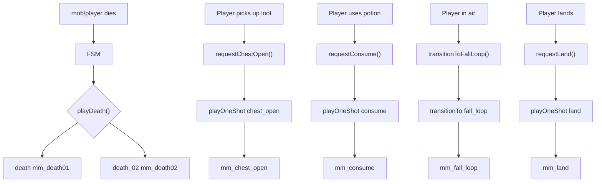

# План интеграции новых анимаций

## Что нужно (по приоритетам)

1. Исправить маппинг имён — каждая GLTF анимация должна иметь уникальный логический ключ
2. Две анимации смерти — случайный выбор
3. `mm_chest_open` для подбора лута (вместо `picking_up`)
4. `mm_consume` для использования зелья из инвентаря
5. `mm_fall_loop` + `mm_land` для падения/приземления (прыжка у игрока нет)
6. Пересмотреть структуру для более удобного добавления анимаций в будущем

## Текущие проблемы

### 1. nameMapping (player.ts:62) — перезапись

```typescript
'mm_death01': 'death',
'mm_death02': 'death',     // перезаписывает mm_death01 — доступна только одна смерть
'mm_punch01': 'sword_attack',
'mm_attack_01': 'sword_attack',  // перезаписывает mm_punch01
```

### 2. oneShotActions (player.ts:87) — ручной список

```typescript
const oneShotActions = ['sword_attack', 'death', 'recievehit'];
```
Новые one-shot нужно не забыть добавить сюда, иначе `setLoop(LoopOnce)` не будет вызван.

### 3. Нет random death

`playDeath()` просто вызывает `playOneShot('death')`, всегда одна и та же анимация.

### 4. Нет fall/land логики

`main.ts` не отслеживает, находится ли персонаж в воздухе.

## Предлагаемая новая структура

### [`client/src/player.ts`](client/src/player.ts:62) — исправленный nameMapping

Каждая GLTF анимация → уникальный логический ключ:

```typescript
const nameMapping: Record<string, string> = {
    // Movement (female)
    'mm_idle': 'idle',
    'mf_walk_fwd': 'walk_fwd',
    'mf_walk_fwd_left': 'walk_fwd_left',
    'mf_walk_fwd_right': 'walk_fwd_right',
    'mf_walk_left': 'walk_left',
    'mf_walk_right': 'walk_right',
    'mf_walk_bwd': 'walk_bwd',
    'mf_walk_bwd_left': 'walk_bwd_left',
    'mf_walk_bwd_right': 'walk_bwd_right',
    'mf_run_fwd': 'run',
    // Death (два варианта для random)
    'mm_death01': 'death',
    'mm_death02': 'death_02',
    // Attack (один основной)
    'mm_punch01': 'sword_attack',
    // Loot pickup
    'mm_chest_open': 'chest_open',
    // Consume (зелье/еда)
    'mm_consume': 'consume',
    // Fall / Land
    'mm_fall_loop': 'fall_loop',
    'mm_land': 'land',
};
```

Анимации, которые не используются (mm_attack_01/02/03, mm_jump, mm_dash, etc.) — не маппим, они будут доступны по raw-имени если понадобятся позже.

### [`client/src/player.ts`](client/src/player.ts:87) — oneShotActions

```typescript
const oneShotActions = [
    'sword_attack', 'death', 'death_02',
    'chest_open', 'consume', 'land',
];
```

### [`client/src/animationStateMachine.ts`](client/src/animationStateMachine.ts:76) — random death

В `playDeath()` — случайный выбор между 'death' и 'death_02':

```typescript
playDeath(onFinished?: () => void): void {
    // ... guard checks ...
    
    // Random death animation
    const deathKeys = ['death', 'death_02'];
    const deathKey = deathKeys[Math.floor(Math.random() * deathKeys.length)];
    const action = this.actions[deathKey] || this.actions['death'];
    if (!action) return;
    
    action.reset();
    action.setLoop(THREE.LoopOnce, 1);
    action.clampWhenFinished = true;
    action.play();
    this.currentStateName = 'death';
    // ... onFinished ...
}
```

### Новые FSM методы

```typescript
// ---------- Подбор лута ----------
requestChestOpen(): void {
    if (this.isDead || this.isDying) return;
    if (this.isPlayingOneShot) return;
    this.playOneShot('chest_open');
}

// ---------- Использование предмета ----------
requestConsume(): void {
    if (this.isDead || this.isDying) return;
    if (this.isPlayingOneShot) return;
    this.playOneShot('consume');
}

// ---------- Приземление ----------
requestLand(): void {
    if (this.isDead || this.isDying) return;
    if (this.isPlayingOneShot) return;
    this.playOneShot('land');
}

// ---------- Падение (лоопер) ----------
transitionToFallLoop(): void {
    if (this.isDead || this.isDying) return;
    if (this.isPlayingOneShot) return;
    this.transitionTo('fall_loop');
}
```

### [`client/src/main.ts`](client/src/main.ts:176) — fall/land в loop()

```typescript
// В начале loop(), после получения позиции:
const terrainY = getTerrainHeightAt(model.position.x, model.position.z);
const isGrounded = model.position.y <= terrainY + 0.2;

if (!isGrounded) {
    // В воздухе — fall loop (если ещё не переключились)
    if (fsm['local']?.currentStateName !== 'fall_loop' && !wasInAir) {
        fsm['local']?.transitionToFallLoop();
        wasInAir = true;
    }
} else if (wasInAir) {
    // Только что приземлились
    fsm['local']?.requestLand();
    wasInAir = false;
}
```

### [`client/src/network.ts`](client/src/network.ts) — вызов chest_open при подборе лута

При получении сообщения об открытии сундука/подборе предмета — вызвать `fsm['local']?.requestChestOpen()`.

### [`client/src/inventoryUI.ts`](client/src/inventoryUI.ts) — вызов consume при использовании

При использовании зелья/еды из инвентаря — вызвать `fsm['local']?.requestConsume()`.

## Изменяемые файлы

| Файл | Что меняем |
|------|-----------|
| [`client/src/player.ts`](client/src/player.ts:62) | nameMapping + oneShotActions |
| [`client/src/animationStateMachine.ts`](client/src/animationStateMachine.ts:76) | random death + новые методы |
| [`client/src/main.ts`](client/src/main.ts:176) | fall/land логика в loop() |
| [`client/src/network.ts`](client/src/network.ts:376) | chest_open при открытии сундука |
| [`client/src/ui/LootWindowUI.ts`](client/src/ui/LootWindowUI.ts) | chest_open при подборе лута |
| [`client/src/inventoryUI.ts`](client/src/inventoryUI.ts) | consume при использовании предмета |

## Mermaid: поток вызова анимаций


